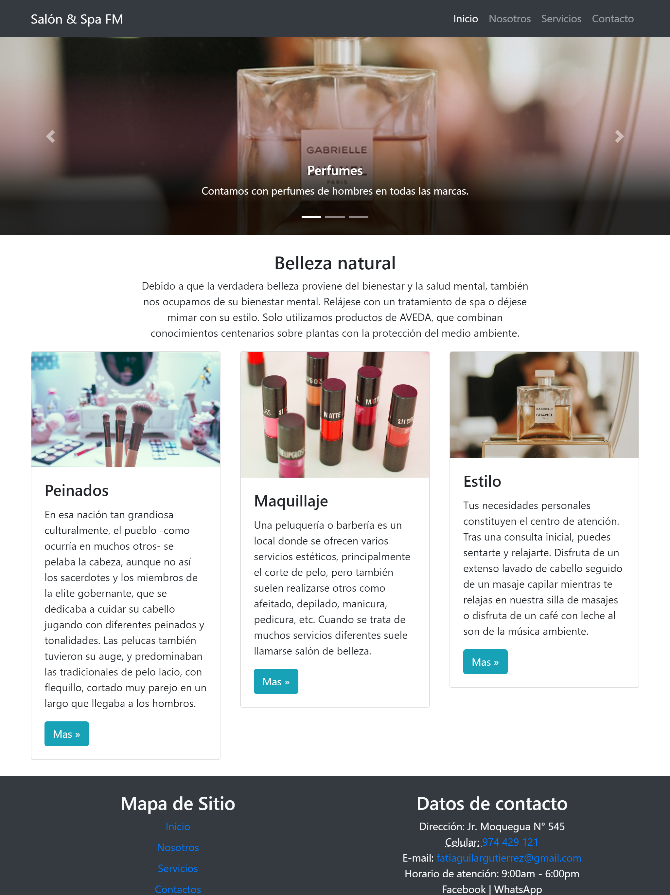

# Diseño de páginas web

### Contenido:
- <a href="#html5">HTML</a>
- <a href="#css">CSS</a>
- <a href="#javascript">JavaScript</a>
- <a href="#bootstrap">Bootstrap</a>
- <a href="#captura-de-pantalla-del-resultado-final">Resultado Final</a>

Este ejemplo muestra la forma básica de crear páginas web haciendo uso de los lenguajes informáticos y lenguajes de programación.
se muestra conceptos básicos de las tecnologías utilizadas:

## HTML5
HTML es un lenguaje de marcado que se utiliza para el desarrollo de páginas de Internet. Se trata de la sigla que corresponde a HyperText Markup Language, es decir, Lenguaje de Marcas de Hipertexto, que podría ser traducido como Lenguaje de Formato de Documentos para Hipertexto.

Sin HTML no es posible crear páginas webs.

- H: hyper
- T: Text
- M: Marckup
- L: Languaje


Documentación anterior obsoleta: https://www.w3.org/html/
Documentación oficial WHATWG: https://spec.whatwg.org/
Documentacion en español: https://lenguajehtml.com/

## CSS
CSS es el lenguaje para describir la presentación de páginas web, incluidos los colores, el diseño y las fuentes. Permite adaptar la presentación a diferentes tipos de dispositivos, como pantallas grandes, pantallas pequeñas o impresoras. CSS es independiente de HTML y se puede utilizar con cualquier lenguaje de marcado basado en XML. La separación de HTML de CSS hace que sea más fácil mantener los sitios, compartir hojas de estilo entre páginas y adaptar las páginas a diferentes entornos. Esto se conoce como la separación de la estructura (o: contenido) de la presentación.
- C: Cascade
- S: Style
- S: Sheet

Hoja de Estilos en Cascada.

## JavaScript
JavaScript es un lenguaje de programación creado con el fin de dar cierta interactividad alos usuarios mediante las páginas webs, puesto que solo con HTML y CSS obtenemos páginas estaticas.

## Bootstrap
Bootstrap es un framework CSS utilizado en aplicaciones front-end _es decir, en la pantalla de interfaz con el usuario_ para desarrollar aplicaciones que se adaptan a cualquier dispositivo.

Algunos componentes de bootstrap utilizados en este ejemplo:

- Navbars: https://getbootstrap.com/docs/4.5/components/navbar/

```html
<!--INICIO Menu de navegación-->
    <nav class="navbar navbar-expand-lg navbar-dark bg-dark navbar-fixed">
        <div class="container">
            <a class="navbar-brand" href="#">Salón & Spa FM</a>
            <button class="navbar-toggler" type="button" data-toggle="collapse" data-target="#navbarSupportedContent" aria-controls="navbarSupportedContent" aria-expanded="false" aria-label="Toggle navigation">
                <span class="navbar-toggler-icon"></span>
            </button>

            <div class="collapse navbar-collapse" id="navbarSupportedContent">
                <ul class="navbar-nav ml-auto">
                    <li class="nav-item active">
                        <a class="nav-link" href="#">Inicio <span class="sr-only">(current)</span></a>
                    </li>
                    <li class="nav-item">
                        <a class="nav-link" href="#">Nosotros</a>
                    </li>
                    <li class="nav-item">
                        <a class="nav-link" href="#">Servicios</a>
                    </li>
                    <li class="nav-item">
                        <a class="nav-link" href="#">Contacto</a>
                    </li>
                </ul>
            </div>
        </div>
    </nav>
    <!--FIN Menu de navegación-->
```

- Carousels: https://getbootstrap.com/docs/4.5/components/carousel/

```html
<!--inicios de slide -->
    <div id="carouselExampleCaptions" class="carousel slide" data-ride="carousel">
        <ol class="carousel-indicators">
            <li data-target="#carouselExampleCaptions" data-slide-to="0" class="active"></li>
            <li data-target="#carouselExampleCaptions" data-slide-to="1"></li>
            <li data-target="#carouselExampleCaptions" data-slide-to="2"></li>
        </ol>
        <div class="carousel-inner">
            <div class="carousel-item active">
                
                <div class="carousel-caption d-none d-md-block">
                    <h5>Perfumes</h5>
                    <p>Contamos con perfumes de hombres en todas las marcas.</p>
                </div>
            </div>
            <div class="carousel-item">
                
                <div class="carousel-caption d-none d-md-block">
                    <h5>Labiales</h5>
                    <p>Resalta tus labios con labiales de colores únicos.</p>
                </div>
            </div>
            <div class="carousel-item">
                
                <div class="carousel-caption d-none d-md-block">
                    <h5>Pack Belleza</h5>
                    <p>Aprovecha y llevate un pack de belleza.</p>
                </div>
            </div>
        </div>
        <a class="carousel-control-prev" href="#carouselExampleCaptions" role="button" data-slide="prev">
            <span class="carousel-control-prev-icon" aria-hidden="true"></span>
            <span class="sr-only">Anterior</span>
        </a>
        <a class="carousel-control-next" href="#carouselExampleCaptions" role="button" data-slide="next">
            <span class="carousel-control-next-icon" aria-hidden="true"></span>
            <span class="sr-only">Siguiente</span>
        </a>
    </div>
    <!--fin de slider-->
```
- Containers(Layout): https://getbootstrap.com/docs/4.5/layout/overview/
- Grid(Layout): https://getbootstrap.com/docs/4.5/layout/grid/

## Captura de pantalla del resultado final:
